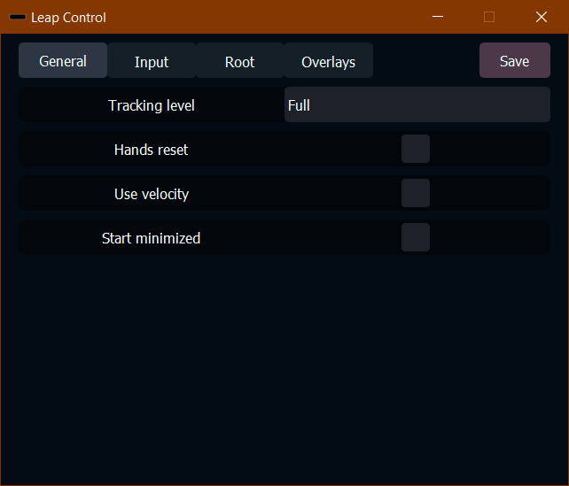
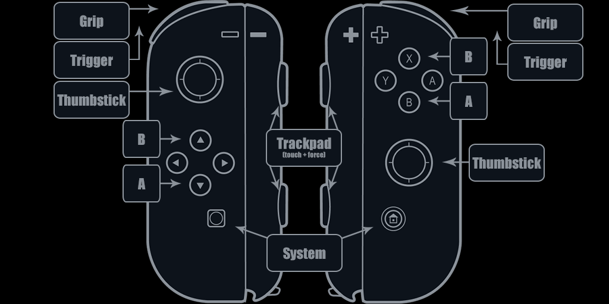

# Driver Leap [](../../releases/latest)
Self-sustainable fork of SteamVR driver for Leap Motion controller with updated vendor libraries

[](https://www.youtube.com/watch?v=RdGnCV2g_oE)
  
## Installation (for users)
* Install [latest Ultraleap Gemini](https://developer.leapmotion.com/tracking-software-download)
* Extract [latest release archive](../../releases/latest) to `<SteamVR_folder>/drivers`
* Add line in section `steamvr` of `<Steam_folder>/config/steamvr.vrsettings` file:
```JSON
"activateMultipleDrivers": true,
```

## Usage
### Settings
Settings are configurated with Leap Control utility application that is launched upon SteamVR start.
<kbd></kbd>

Alternatively, you can edit manually `resources/settings.xml` configuration file.  
Settings are saved upon SteamVR exit, or manually with `Save` button at top-right corner.  
Leap Control can be minimized to tray icon and shown again by double-clicking tray icon.

### Gestures
List of hands gestures that correspond to controller original input:
* **Grip:** bending of middle, ring and pinky fingers
* **Trigger:** bending of index finger

By default other buttons/inputs are available through hand overlays or connected controllers (by enabling corresponding option in `General` tab of utility app).
Currenty supported controllers:
* Nintendo Joy-Cons controllers:
  * <kbd></kbd>
* Sony Playstation DualShock 4:
  * (TBA)

## Notes
* If you see only green dots that represent tip of your index fingers, force `leap_control` to launch on dGPU through control panel of your GPU vendor.
* Coordinate system used for offsets and angles is right handed (as in OpenGL).  
<kbd></kbd>
