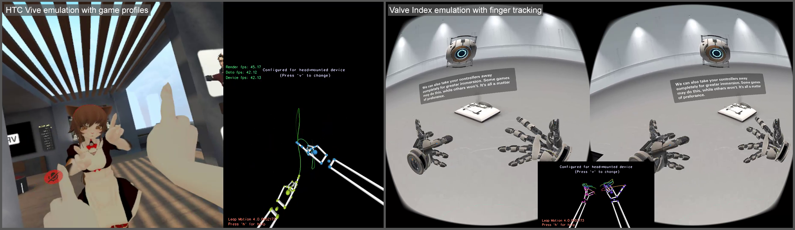

[](https://ci.appveyor.com/project/SDraw/driver-leap) [](../../releases/latest)

Fork with updated vendor libraries and extended features.

[](https://www.youtube.com/playlist?list=PLiEPsxTlqsDk5GKcgsmeDQNRs7KV8lI-s)
  
### Installation
* Install [base project driver](https://github.com/cbuchner1/driver_leap)
* Grab [latest release](../../releases/latest) for your platform
* Extract files to "<your_drive_letter>:/Program Files/SteamVR Leap Motion driver/leap"

### Building
* Open solution in Visual Studio 2013/2015/2017
* Build your platform:
  * x64 - build output is in "<solution_folder>/x64"
  * x86 - build output is in "<solution_folder>/Win32"
* Copy build files to "SteamVR Leap Motion driver/leap/bin/<your_platform>":
  * driver_leap.dll
  * gesture_checker.exe
  * leap_monitor.exe
* Copy additional shared libraries to "SteamVR Leap Motion driver/leap/bin/<your_platform>":
  * vendor/LeapSDK/lib/<your_platform>/LeapC.dll
  * vendor/openvr/bin/<your_platform>/openvr_api.dll
* Copy control_config.xml, vive_profile.json and index_profile.json from solution root to "SteamVR Leap Motion driver/leap/cfg"
  
### Control configuration and inputs
Driver can emulate HTC Vive controllers and Valve Index controllers with skeletal animation. It's adjusted by control_config.xml in 'cfg' folder.  
There are more configurable restrictions, such as global input, trackpad, trigger, grab and etc.

### Game profiles for HTC Vive controllers emulation
Game profiles are enabled automatically when game is started from Steam.
Available game profiles:
  * **vrchat** - profile for VRChat. Control restrictions are ignored.  
  Game gestures:
    * Gun - corresponding hand gesture
    * V-shape - corresponding hand gesture
    * Point - corresponding hand gesture
    * Rock out - corresponding hand gesture
    * Thumbs up - corresponding hand gesture
    * Spread hand - corresponding hand gesture. Also corresponds to grip button.
    * Trigger - grab gesture
    * Application menu - formed T-shape with two hands
  * **default** - profile for other games.  
  Gestures:
    * Trigger - bending of the index finger
    * Grip - grab gesture
    * System menu - formed T-shape with two hands
    * Application menu - hand with palm directed towards face
    * Touchpad - thumb press
    * Touchpad circle - index finger of another hand directed to palm
    
### Valve Index controllers emulation
By default, controller models aren't in right folder of SteamVR, and you have to add them by yourself.
Copy all folders from '<SteamVR_folder>\drivers\indexcontroller\resources\rendermodels' to '<SteamVR_folder>\resources\rendermodels'.  
List of available gestures:
* Trigger - bending of the index finger
* Grip - bending of middle, ring and pinky fingers
* Touchpad - thumb press
* Touchpad circle - index finger of another hand directed to palm
* Thumbstick press - touch of thumb finger tip by index finger tip of another hand
* Button A - pinch gesture (tips of thumb finger and index finger)
* Button B - tips of thumb finger and pinky finger
* System button - formed T-shape with two hands

Currently, there are no free gestures that can simulate thumbstick direction.

### Troubleshooting
Sometimes installation of [base project driver](https://github.com/cbuchner1/driver_leap) doesn't register driver folder for SteamVR. To manually add it:
* Open console as administrator in *SteamVR/bin/win32* (or *SteamVR/bin/win64* if you have 64-bit OS) and execute command:
```
vrpathreg adddriver "path_to_leap_folder"
```
* Check if driver folder is added by calling 'vrpathreg' without any arguments
* Open *steamvr.vrsettings* in *Steam/config* folder and add line in "steamvr" section:
```JSON
"activateMultipleDrivers": true,
```
